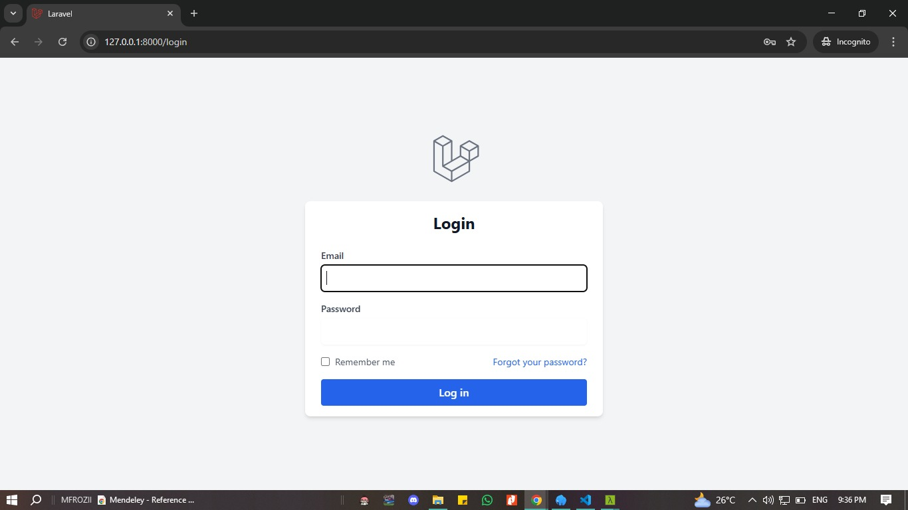
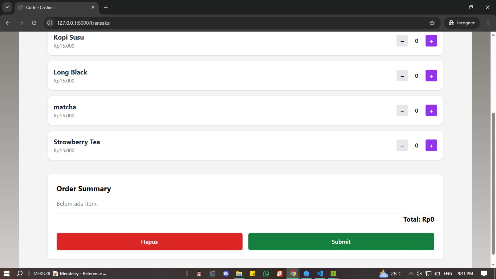
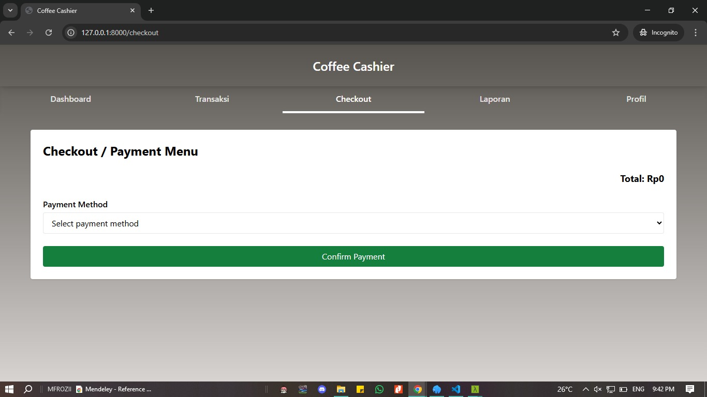
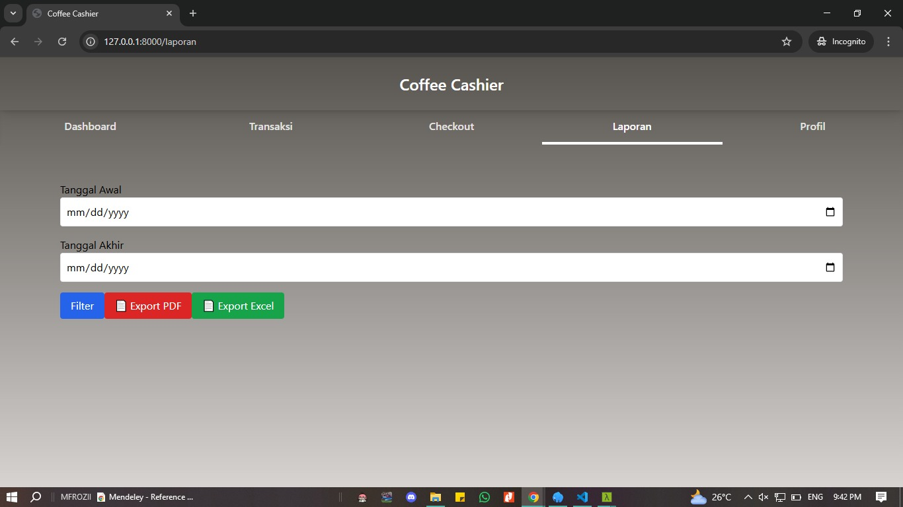
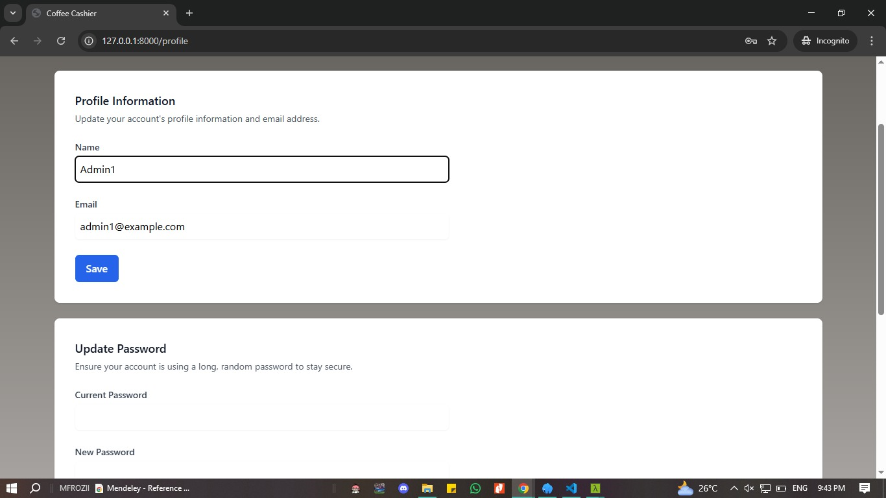

# Kasir Coffee - Laravel + Livewire

Sistem aplikasi kasir sederhana berbasis web untuk coffee shop. Dibuat dengan Laravel 12 dan Livewire versi terbaru.

## 🔥 Fitur Utama

- 💻 Tampilan antarmuka modern dengan TailwindCSS
- 📦 Manajemen menu dan transaksi
- ➕➖ Tambah dan kurangi jumlah pesanan
- 🛒 Order summary (keranjang) interaktif
- 💳 Checkout dengan metode pembayaran (Cash / QRIS)
- 🧾 Simpan transaksi ke database
- 📈 Laporan transaksi (siap dikembangkan lebih lanjut)

## 🛠️ Teknologi

- Laravel 12
- Livewire 3
- TailwindCSS
- MySQL
- Vite

## ⚙️ Instalasi

```bash
# Clone project ini
git clone https://github.com/username/kasir-coffee.git
cd kasir-coffee

# Install dependency
composer install
npm install && npm run dev

# Setup environment
cp .env.example .env
php artisan key:generate

# Migrasi database
php artisan migrate

# Jalankan server
php artisan serve

## 📸 Screenshot







